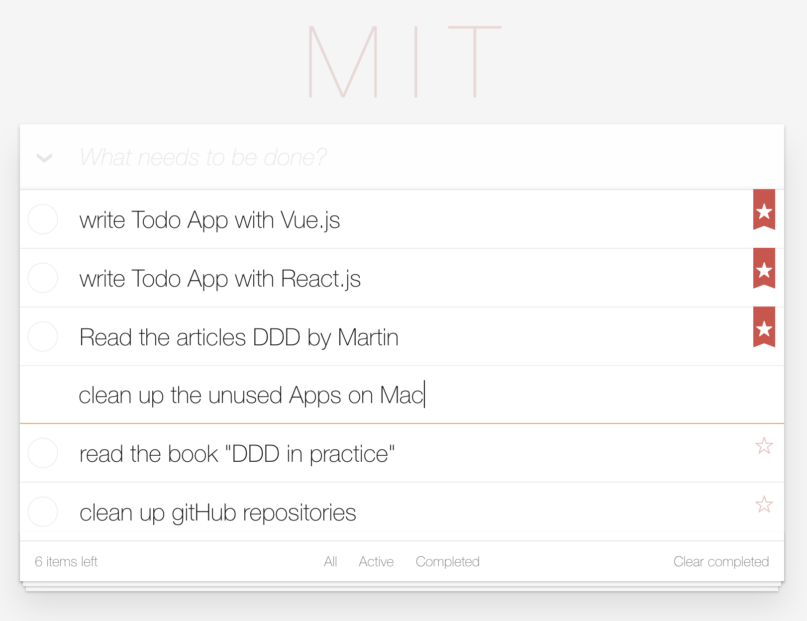
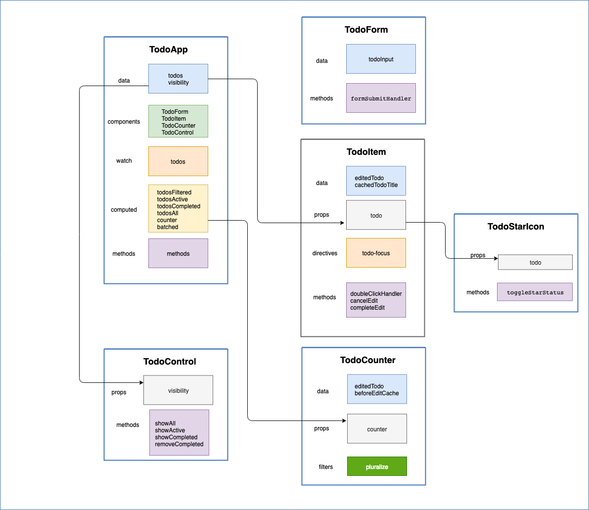

# M.I.T Todo App
[Demo App in Vue.js](https://mit-todo.netlify.com/)

This Todo Demo App is implemented with `Vue.js`.

I have also implemented two variants with `react.js` and `react+redux`:
- [Demo Todo in React.js](https://mit-todo-react.netlify.com/)
- [Demo Todo in react.js with Redux support](https://mit-todo-redux.netlify.com/)

## What is `MITs`
Never feel overwhelmed at work again- the M.I.T. technique. A `Most Important Task (MIT)` is a 
critical task that will create the most significant results. 
Every day, create a list of `two or three M.I.T.s`, and focus on getting them done as soon as 
possible. Keep this list separate from your general to-do list. Read more about [MITs](https://personalmba.com/most-important-tasks/).  





## Project setup
```
yarn install
```

### Compiles and hot-reloads for development
```
yarn run serve
```

### Compiles and minifies for production
```
yarn run build
```

### Lints and fixes files
```
yarn run lint
```

### Customize configuration
See [Configuration Reference](https://cli.vuejs.org/config/).




## License
[MIT](http://opensource.org/licenses/MIT)


Copyright(c) 2019-present, Xun Zhou
